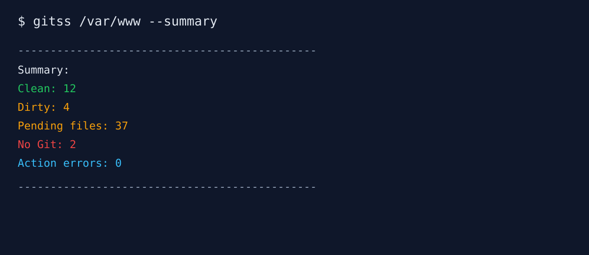
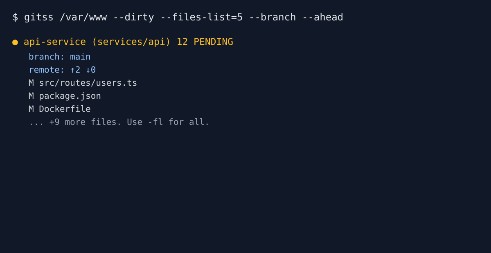
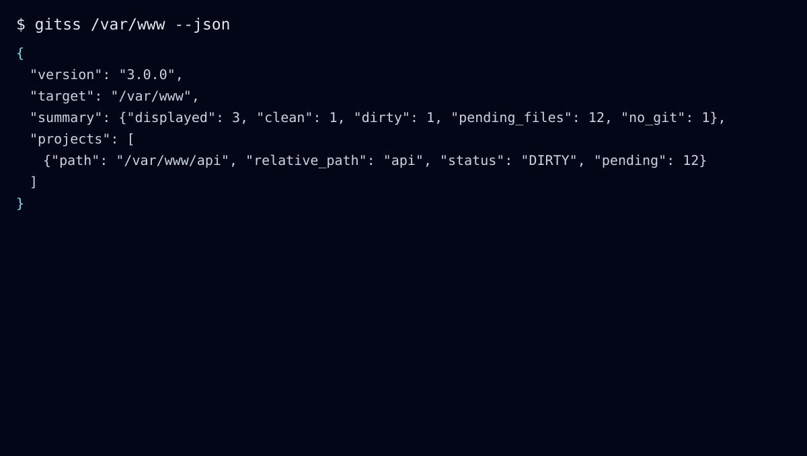

# GitSScan (`gitss`)

[](https://github.com/previraza/gitsscan/actions/workflows/ci.yml)
[](./LICENSE)
[](https://www.gnu.org/software/bash/)
[](./CHANGELOG.md)

GitSScan is a DevOps-oriented Bash CLI that scans directories, auto-detects web projects, and audits Git state across many repositories.

## Features

- Scan modes: `--scan-mode=mixed` (default, web markers + all Git repos), `--scan-mode=web` (markers only), `--scan-mode=git` (all Git repositories).
- Detects web projects via `package.json`, `composer.json`, `artisan`, `next.config.*`, `vite.config.*`, `index.php`.
- Handles pnpm/turbo mono-repo markers.
- Deduplicates repositories by Git root.
- Status modes: `CLEAN`, `PENDING`, `NO GIT`.
- Git actions: `fetch`, `pull`, `commit`, `push`.
- Safe mode confirmations and dry-run support.
- JSON output for scripts and monitoring.

## Screenshots

Add your real captures in `docs/screenshots/` and update links below.

- Scan overview
  
- Dirty projects with files
  
- JSON report output
  

## Terminal Preview

```text
$ gitss /var/www --dirty --files-list=5 --branch --ahead
● api-service (services/api) 12 PENDING
    branch: main
    remote: ↑2 ↓0
    M src/routes/users.ts
    M package.json
```

## Installation

### Quick install

```bash
git clone https://github.com/gitsscan/gitss.git
cd gitss
./install.sh
```

### Custom prefix

```bash
./install.sh --prefix="$HOME/.local"
```

## Usage

```bash
gitss /var/www
gitss /var/www --scan-mode=mixed --summary
gitss /var/www --scan-mode=web --dirty --files-list=all
gitss /srv/projects --scan-mode=git --summary
gitss /srv/projects --scan-mode=git --workers=4 --summary
gitss /var/www --summary
gitss /var/www --json
gitss /var/www --fetch --pull --dry-run
```

## Combined Commit + Push

Yes, this is supported in a single command:

```bash
gitss /var/www --dirty --commit="GitSScan -- 15:06 21-11-2026" --push
```

Execution order per repository is:

1. `git add -A`
2. `git commit -m "..."`
3. confirmation prompt
4. `git push`

If commit fails on one repository, that repository push is skipped and scan continues for others.

## Options

- `--dirty`, `--clean`, `--no-git`
- `-fl`, `--files-list`, `--files-list=N`, `--files-list=all`
- `--scan-mode=mixed|web|git`, `--workers=N`, `--branch`, `--ahead`, `--last-commit`, `--disk`, `--summary`
- `--json`, `--no-color`
- `--fetch`, `--pull`, `--commit`, `--commit="msg"`, `--push`
- `--dry-run`, `--unsafe`, `--config=PATH`

## Benchmark Workers

```bash
./scripts/bench-workers.sh /srv/projects mixed
```

## Distribution

- GitHub Release automation (tag `v*.*.*`): `.github/workflows/release.yml`
- Homebrew formula template: `packaging/homebrew/gitss.rb`
- Debian packaging config (`nfpm`): `packaging/nfpm.yaml`

Detailed steps: [docs/DISTRIBUTION.md](./docs/DISTRIBUTION.md)

## Error Handling & Dependencies

Required commands:

- `bash`
- `git`
- `find`
- `du`
- `wc`
- `tr`
- `sed`
- `head`
- `awk`
- `dirname`

If one is missing, GitSScan exits with a clear error, for example:

```text
Error: Missing required command: git
```

Action failures are isolated per repository (`fetch/pull/commit/push`) and counted in summary as `Action errors`.

In non-interactive mode (CI/cron), safe mode will skip confirmation-based actions (like `--push`) with a warning instead of blocking on input.

## Config File (`~/.gitssrc`)

Example: [examples/gitssrc.example](./examples/gitssrc.example)

```bash
TARGET_DIR="$HOME/projects"
FILES_LIST="limit"
FILES_LIMIT=8
SHOW_BRANCH=true
SHOW_AHEAD=true
SAFE_MODE=true
```

## Project Layout

- `bin/gitss`: executable entrypoint
- `lib/`: modular runtime (`core`, `cli`, `scanner`, `git_ops`, `output`)
- `tests/`: shell smoke and behavior tests
- `scripts/`: release and maintenance scripts
- `docs/`: architecture, roadmap, publishing strategy
- `examples/`: sample config and JSON output
- `.github/workflows/`: CI pipelines

## Security Defaults

- Safe mode enabled by default.
- Confirmation before push.
- No destructive reset operations.
- `--dry-run` for validation before write actions.

See [docs/SECURITY.md](./docs/SECURITY.md).

## Roadmap

See [docs/ROADMAP.md](./docs/ROADMAP.md).

## Contributing

1. Fork repository.
2. Create feature branch.
3. Run checks:

```bash
./tests/smoke.sh
shellcheck bin/gitss lib/*.sh install.sh uninstall.sh scripts/*.sh tests/*.sh
```

4. Open PR with test evidence.

## License

MIT - see [LICENSE](./LICENSE).
